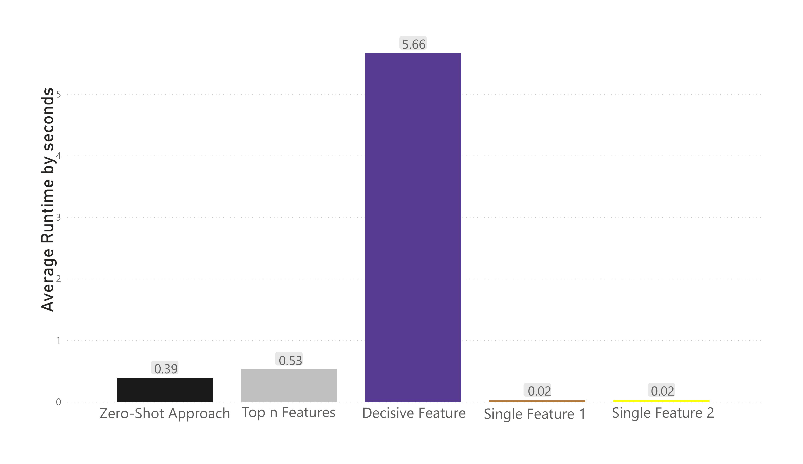

# Zero-Shot Approach Documentation

This repository contains the Python code utilized during the experiments conducted for the accompanying paper **Tell Me More! Using Multiple Features for Binary
Text Classification with a Zero-Shot Model.** 
Below, you will find detailed instructions on how to execute the code, and the [appendix](#appendix) is provided at the end of the document for additional reference.


## Dataset Requirements

The dataset to be predicted should be stored in an **Excel file** and must contain two mandatory columns:

1. **Id Column**: Represents the unique index of the text sequence. The name of the column should be `id`.
2. **Text Column**: Stores the input text sequence to be predicted. The name of the column should be `text_sequence`.

The name of the sheet should be `text_seq`.

### Category Labels
For the category labels, there should be either:

- A **separate sheet** in the same Excel file, or
- A **separate Excel file**.

The category labels sheet/file should contain two mandatory columns:

1. **Category 1 Column**: Stores the labels list for Category 1. The name of the column should be `category1`.
2. **Category 2 Column**: Stores the labels list for Category 2. The name of the column should be `category2`.

The name of the sheet should be `labels`.

---

## Running the Zero-Shot Approach Code

To run the zero-shot approach code, the following **mandatory arguments** are required:

1. **Dataset file** (`--text`): The file path of an Excel file containing the text sequence.
2. **Labels file** (`--labels`): The file path of an Excel file containing the labels.
3. **Confidence Level** (`--confidence`): A confidence level value between 0 and 1.
4. **Certainty Level** (`--certainty`): A certainty level value greater than 0.
5. **Aggregation Method** (`--agg`): The aggregation method to be used. 

   Accepted values (case-sensitive):
   - `Sum`
   - `Ordered Sum`
   - `Label Mean`
   - `Ordered Label Mean`

6. **Optional Argument - Output file name** (`--output`): Name of the output file. By default, the output file will be named `Predictions.xlsx`.

### Example Command

```bash
python zero_shot_approach.py --text 'Dataset.xlsx' --labels 'Dataset.xlsx' --confidence 0.5 --certainty 1 --agg "Sum" --output "predictions.xlsx"
```

## Troubleshooting

In case of problems with reading the model from Hugging Face, you can manually download the repository and provide the local path in the code:

- Repository: [xlm-roberta-large-xnli](https://huggingface.co/joeddav/xlm-roberta-large-xnli)

---

## Programming Framework

The zero-shot approach code uses the following python libraries:

- **Programming Languages**: Python (Version 3.7.5)
- **Development Tools**: Visual Studio Code (Version 1.71)
- **Libraries**:
  - `torch` (Version 1.12.1)
  - `transformers` (Version 4.21.2)
  - `scikit-learn` (Version 0.22.2)
  - `numpy` (Version 1.18.1)
  - `pandas` (Version 1.3.5)
  - `matplotlib` (Version 3.2.1)

---

## Model Information

You can use the model from the Hugging Face repository:

- [Hugging Face Model: xlm-roberta-large-xnli](https://huggingface.co/joeddav/xlm-roberta-large-xnli)

---

## Appendix

The PDF version is available [here](./Appendix.pdf).

### Appendix A: Features
<p align="center">

for
“Tell Me More! Using Multiple Features for Binary
Text Classification with a Zero-Shot Model”
by
David Broneske, Nikhilkumar Italya, & Fabian
Mierisch
</p>

#### Table I: Features Waiting List


| Yes - Email is a waiting list offer      | No - Email is not a waiting list offer     |
|------------------------------------------|--------------------------------------------|
| Wir können Sie auf die Warteliste setzen | Wir können Sie auf keine Warteliste setzen |
| Die Aufnahme ist möglich                 | Die Aufnahme ist nicht möglich             |
| Die Plätze sind noch nicht voll          | Die Warteliste ist voll                    |
| Bitte tragen Sie sich ein                | Bitte eintragen Sie sich nicht             |
| Bitte registrieren Sie sich              | Bitte registrieren Sie sich nicht          |
| Bitte melden Sie sich an                 | Bitte anmelden Sie nicht an                |
| Sie können sich einschreiben             | Sie können sich nicht einschreiben         |
| Eventuell haben wir noch Platz           | es tut mir leid                            |
| die Zulassung ist noch offen             | Die Registrierungen sind abgeschlossen     |
| wenn Sie wollen                          | Wir müssen Ihre Anfrage abweisen           |
| Bitte füllen Sie das Formular aus        |                                            |
| Bitte benutzen Sie das Portal            |                                            |
| Bitte benutzen Sie den Link              |                                            |
| zurückschicken                           |                                            |
| Bitte füllen Sie alle Angaben aus        |                                            |


**Notes:** Table shows the features for outcome classes "Yes" and "No" of the outcome Waiting List. Features aim to provide context for the classification of the algorithm while simultaneously comply with class definitions. Out of the 12'547 observations 9'976 (79.5%) were humanly labeled as a waiting list offer and 2'571 (20.49%) as not a waiting list offer.

#### Table II: Features Answer

| **Yes - Email contains an answer to the question "Do you still have a slot available"** | **No - Email does not contain an answer to the question "Do you still have a slot available"** |
|----------------------------------------------------------------------------------------|-----------------------------------------------------------------------------------------------|
| Wir können Ihnen einen Platz anbieten                                                  | Wir nehmen Kinder immer zum neuen Kindergartenjahr auf                                         |
| Wir haben noch ein bis zwei freie Plätze                                                | Die Krippenplätze werden zentral vergeben                                                      |
| Bei uns sind noch Plätze frei                                                           | Wir nehmen Kinder ab drei Jahren auf.                                                          |
| Wir können Ihnen für Januar keine Zusage machen                                         | Bitte wenden Sie sich an ...                                                                   |
| Gruppen sind bereits voll                                                               | Wir betreuen in der Krippe nur Kinder im Alter von 1-3 Jahren                                  |
| Wir haben alle Plätze besetzt                                                           | Sie stehen jetzt auf unserer Warteliste                                                        |
| So junge Kinder nehmen nur Kinderkrippen auf                                            | Bitte rufen Sie doch einfach mal an                                                            |
| Wir haben noch Kapazitäten                                                              | Anmeldephase läuft noch.                                                                       |
| Ich kann derzeit nicht sagen, ob ein Platz frei ist                                     | Wohnen Sie denn in ... ?                                                                       |
| Nur noch wenige Plätze frei                                                             | Wir nehmen Kinder erst ab ...                                                                  |
| Platzvergabe für 21/22 abgeschlossen                                                    | Ich würde ihr Kind bei uns auf die Warteliste setzen.                                          |
| Warteliste jetzt schon überfüllt                                                        | Gerne nehme ich Ihr Kind auf unsere Interessentenliste auf                                     |
| Für Januar noch nicht zusagen.                                                          | Anmeldeverfahren beendet                                                                       |
| Wenige Plätze verfügbar                                                                 | beendet                                                                                       |
| Verfügbarkeit kommt darauf an ob ...                                                    | Für die Vergabe nicht zuständig.                                                               |
| Die Platzvergabe wird vom Jugendamt koordiniert                                         |                                                                                               |
| Unterbringen                                                                            |                                                                                               |
| Bei uns aufnehmen                                                                       |                                                                                               |
| Noch verfügbar                                                                          |                                                                                               |
| Noch nicht absehbar                                                                     |                                                                                               |
| Platz frei                                                                              |                                                                                               |
| Keine Neuaufnahmen mehr                                                                 |                                                                                               |
| Nur auf die Warteliste                                                                  |                                                                                               |
| Wir sind leider schon voll ausgelastet                                                  |                                                                                               |
| Für einen Platz in der Krippe, müssen Sie sich ... bitte an das Rathaus wenden.         |                                                                                               |
| Mit dem Stand von heute kann ich Ihnen leider keinen Platz für Januar 2022 anbieten.    |                                                                                               |
| Wir können nur Kinder aus dem Wohnumfeld aufnehmen, wenn Bedarf der Mitarbeiter gedeckt |                                                                                               |

**Notes:** Table shows the features for outcome classes “Yes” and “No” of the outcome Slot Offer. Features aim to
provide context for the classification of the algorithm while simultaneously complying with class definitions. Out of
the 12’547 observations, 798 (6.4%) were humanly labeled as slot offers and 11’749 (93.6%) as not a slot offer


#### TABLE III: Features for Single Feature Baseline Comparison

| **Category**                                  | **Yes class label**                              | **No class label**                             |
|-----------------------------------------------|-------------------------------------------------|------------------------------------------------|
| **Waiting List - Single Label Combination 1** | Wir können Sie auf die Warteliste setzen        | Die Aufnahme ist nicht möglich                 |
| **Waiting List - Single Label Combination 2** | Wir können Ihnen einen Platz auf der Warteliste anbieten | Eine Aufnahme ist derzeit nicht möglich        |
| **Answer - Single Label Combination 1**       | Wir haben noch einen Platz frei                 | Wir haben keinen Platz frei                    |
| **Answer - Single Label Combination 2**       | Wir haben einen Platz anzubieten                | Wir haben keinen Platz mehr anzubieten         |

**Notes:** Table shows the features for outcome classes “Yes” and “No” of the outcome Answer 2. Features may or may not be
citations from actual emails (frequently used expressions and key words) and aim to provide context for the classification
of the algorithm while simultaneously complying with class definitions. Out of the 12’547 observations, 10’148 (80.9%)
were humanly labeled as containing an answer to the question “How can we apply for a slot?” and 2’399 (19.1%) as not
containing an answer to the question.

### Appendix B:  PSEUDO CODE FOR MAIN ALGORITHM AND BASELINES

#### Algorithm 1: Pseudo Code - Main Algorithm

This algorithm outlines the main steps for classifying text instances based on features. 

##### Inputs
- **text_instances**: Text instances 
- **features_cat1**: Feature list of class 1 
- **features_cat2**: Feature list of class 2 
- **agg**: Calculate the feature mean and aggregate it
- **certainty_lvl**: Certainty level  
- **confidence_lvl**: Prediction confidence
- **ord**: Feature ordering and permutation method

##### Output
- Classified class or "undecided"

##### Algorithm Steps

1. **Initialize Variables**
   - `agg_prob_1 = 0`
   - `agg_prob_2 = 0`
   - `prob_reduction = 0.5` 

2. **Order the Feature Combinations**
   - `perms = ord(features_cat1, features_cat2)`

3. **Begin Classification**
   - For each text instance `i` in `text_instances`:
     - For each feature combination `p` in `perms`:
       - Calculate the probability score of each feature:
         - `prob_1, prob_2 = calculate_probs(text_instance_{i}, p)`
         
       - Check if the difference between class features is larger than the Prediction Confidence:
         - If `abs(prob_1 - prob_2) > confidence_lvl`:
           - `prob_1 = prob_1 - prob_reduction`
           - `prob_2 = prob_2 - prob_reduction`
           
           - **Aggregate Feature Means**:
             - `agg_prob_1 = agg(agg_prob_1, prob_1)`  
             - `agg_prob_2 = agg(agg_prob_2, prob_2)`
             
           - **Make Classification Decision**:
             - If `agg_prob_1 > certainty_lvl`:
               - Return `Class 1`
             - Else If `agg_prob_2 > certainty_lvl`:
               - Return `Class 2`
               
4. **For all unclassified text instances**:
   - Return `Undecided`


#### Algorithm 2: Pseudo Code - Top n Features Baseline

This algorithm outlines the steps for classifying text instances using the top `n` features based on their probability scores.

##### Inputs
- **text_instances**: Text instances
- **features_class1**: Feature list of class 1  
- **features_class2**: Feature list of class 2 
- **feature_lists**: Combined feature lists of class 1 and 2

##### Output
- Classified category

##### Algorithm Steps

1. **Sort Predictions**
   - `sort(predictions_each_feature)`

2. **Determine Top n Features**
   - `top_n = min(length(features_class1), length(features_class2))`
   - If `top_n` is even:
     - `top_n = top_n + 1`

3. **Begin Classification**
   - For each text instance `i` in `text_instances`:
     - Calculate the probability score of combined feature lists:
       - `prob_1, prob_2 = calculate_probs(text_instance_{i}, feature_lists)`
       
     - Take the `n` number of features with the highest probability:
       - `order_predictions = ord(predictions_each_feature)`
       - `top_n_list = order_predictions[0...top_n-1]`
       
     - Calculate the probability score of "Top n" features:
       - `prob_1, prob_2 = calculate_probs(text_instance_{i}, top_n_list)`
       
     - **Implement Majority Voting**:
       - `count_cat1, count_cat2 = count_by_cat(top_n_list)`
       
     - **Make Classification Decision**:
       - If `count_cat1 > count_cat2`:
         - Return `1`
       - Else:
         - Return `2`


#### Algorithm 3: Pseudo Code - Decisive Feature Baseline

This algorithm outlines the steps for classifying text instances using the most decisive feature combination.

##### Inputs
- **text_instances**: Text instances
- **features_class1**: Feature list of class 1  
- **features_class2**: Feature list of class 2

##### Output
- Classified category

##### Algorithm Steps

1. **Initialize Variables**
   - `permutations = [features_class1] * [features_class2]`
   - `max_prob_perm`

2. **Begin Classification**
   - For each text instance `i` in `text_instances`:
     - **Find Most Decisive Label Combination**:
       - For each permutation `p` in `permutations`:
         - **Make Class Prediction**:
           - `curr_perm_prob = calculate_prob(text_seq, p)`
           
         - **Choose the Most Decisive Prediction**:
           - If `curr_perm_prob > max_prob_perm`:
             - `max_prob_perm = curr_perm_prob`

3. **Make Classification Decision**:
   - If `max_prob_cat(max_prob_perm) = cat1`:
     - Return `1`
   - Else:
     - Return `2`


### Appendix C: RUNTIME OF BASELINES AND THE APPROACH



**Note:** The figure shows average runtimes in seconds for our machine configurations for each approach per text instance. The runtime for our Zero-Shot approach is calculated for a *Certainty Level* of 2 and a *Prediction Confidence* of 0.8.
